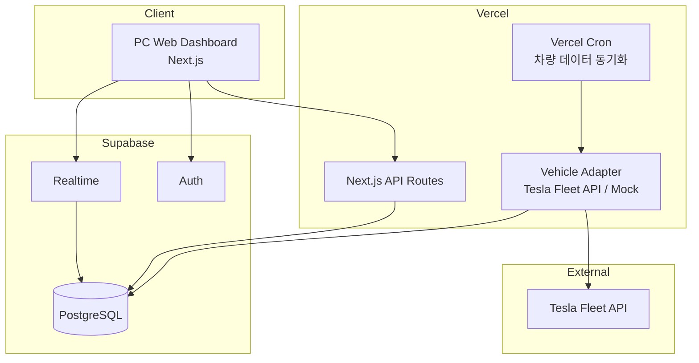

# FMS 기술스택 요구사항 정의서

## 1. 문서 개요

| 항목 | 내용 |
|------|------|
| 목적 | MVP를 빠르고 안정적으로 구현하기 위한 기술 스택·개발 방법론 정의 |
| 참조 문서 | `requirements.md`, `requirements-benchmarking.md` |
| 대상 독자 | 1인 개발자, 향후 합류 예정 엔지니어 |
| 적용 범위 | 데모데이 MVP (PC 웹 대시보드, 전기차 1종, Deviceless 데이터 수집) |

---

## 2. 기술 선정 기준

프로젝트 제약과 목표에 따라 아래 기준으로 기술을 평가한다.

| 우선순위 | 기준 | 설명 |
|----------|------|------|
| 1 | **개발 속도** | 1인·Cursor AI 환경에서 초기 MVP를 가장 빨리 완성할 수 있는가 |
| 2 | **데모 안정성** | 시연 중 끊김 없이 동작할 수 있는가 (mock·폴백 포함) |
| 3 | **운영 부담** | 서버·DB·인증을 직접 관리하는 비용이 낮은가 |
| 4 | **실시간성** | 차량 위치·상태를 대시보드에 반영하기 적합한가 |
| 5 | **확장성** | 투자 이후 기능·차종·사용자 증가에 대응 가능한가 |
| 6 | **AI 개발 친화도** | Cursor 등 AI 도구가 코드 생성·수정에 유리한 스택인가 |

---

## 3. 아키텍처 후보 비교

### 3.1 비교 대상

| 옵션 | 구성 | 한 줄 요약 |
|------|------|------------|
| **A. Spring 풀스택** | Java + Spring Boot + React/Vue + PostgreSQL | 엔터프라이즈 표준, 구조는 견고하나 MVP 속도는 느림 |
| **B. Firebase BaaS** | React/Next.js + Firebase (Auth, Firestore, Functions) | 초기 셋업·실시간 UI는 빠르나 관계형·집계에 약함 |
| **C. Next.js + Supabase** ★ | TypeScript + Next.js + Supabase (PostgreSQL) | **1인 MVP에 균형이 가장 좋음 (추천)** |
| **D. Next.js 단독 + Mock** | Next.js + 로컬/인메모리 데이터 | UI·데모만 급할 때, 실서비스 전환 시 재작업 큼 |

### 3.2 상세 비교

| 평가 항목 | A. Spring | B. Firebase | C. Next.js + Supabase |
|-----------|-----------|-------------|------------------------|
| MVP 개발 속도 | △ | ◎ | ◎ |
| 1인 운영 부담 | △ (인프라 직접 관리) | ◎ | ◎ |
| 실시간 대시보드 | ○ (WebSocket 별도 구현) | ◎ (Realtime DB) | ○ (Realtime 구독) |
| 차량·운행 이력 (관계형) | ◎ | △ | ◎ |
| 지오펜싱·위치 쿼리 | ◎ (PostGIS) | △ | ◎ (PostGIS) |
| OEM API 폴링/배치 | ◎ (@Scheduled) | ○ (Cloud Functions) | ○ (Cron + API Route) |
| B2B 데모 신뢰도 | ◎ | ○ | ○ |
| Cursor AI 코드 생성 품질 | ○ | ○ | ◎ (TS 단일 언어) |
| 월 운영비 (MVP) | △~○ | ○ (무료 티어) | ○ (무료 티어) |
| 팀 확장 시 채용 | ◎ (국내 Java 인력) | ○ | ○ (TS 풀스택) |
| 벤더 종속 | ○ | △ (Firebase) | ○ (PostgreSQL 표준) |

### 3.3 Spring vs Firebase — 핵심 판단

#### Spring Framework를 선택할 때 유리한 경우
- Java/Spring 경험이 풍부하고 팀 확장을 Java 중심으로 계획할 때
- 복잡한 배치·정산·다중 OEM 연동을 MVP 직후 바로 붙일 때
- 대기업·공공 RFP 대응 등 **Java 스택 필수** 요건이 있을 때

#### Firebase를 선택할 때 유리한 경우
- **인증 + 실시간 UI**만 먼저 빠르게 보여줘야 할 때
- 데이터 모델이 단순하고(차량 현재 상태 위주) 이력·집계 요구가 적을 때
- 모바일 앱(운전자용)을 Firebase와 함께 빠르게 붙일 때

#### Spring / Firebase 모두 MVP 1순위로 보기 어려운 이유
- **Spring**: 보일러플레이트·인프라 셋업으로 1인 데모데이 일정에 부담
- **Firebase**: 운행 이력, 기간별 집계, Geofencing, 정비 이력 등 FMS 확장 시 Firestore 한계가 빠르게 드러남

### 3.4 최종 추천

> **추천 스택: 옵션 C — Next.js (TypeScript) + Supabase (PostgreSQL)**

이유:
1. **단일 언어(TypeScript)** 로 프론트·API·타입을 공유해 Cursor AI 생산성이 높음
2. **PostgreSQL** 기반이라 차량·운행·이벤트 등 관계형 모델과 향후 PostGIS(지오펜싱)에 유리
3. **Supabase**가 인증·DB·Realtime·Storage를 제공해 1인이 인프라에 시간 쓰지 않아도 됨
4. **Vercel** 배포로 데모 URL을 즉시 공유 가능
5. 투자 후 규모가 커지면 API 레이어만 Spring 등으로 분리하는 **점진적 마이그레이션**이 가능

---

## 4. 추천 기술 스택 (확정안)

### 4.1 스택 요약

```
[브라우저]  PC Web Dashboard (관리자)
     │
     ▼
[Frontend]  Next.js 15 + React 19 + TypeScript
     │      Tailwind CSS + shadcn/ui
     │      TanStack Query (서버 상태)
     │      Map: Kakao Maps JS API (국내 데모) / Mapbox (대안)
     ▼
[Backend]   Next.js App Router (Route Handlers / Server Actions)
     │      - REST API
     │      - OEM 데이터 수집 어댑터 (Adapter 패턴)
     │      - Vercel Cron: 주기적 차량 데이터 동기화
     ▼
[Database]  Supabase — PostgreSQL 15+
     │      - Prisma ORM (스키마·마이그레이션)
     │      - Supabase Realtime (선택: 실시간 위치 반영)
     ▼
[Auth]      Supabase Auth (이메일/매직링크, MVP 단일 관리자)
     ▼
[Deploy]    Vercel (웹·API) + Supabase Cloud (DB·Auth)
     ▼
[External]  Tesla Fleet API (OAuth) + Mock Provider (데모 폴백)
```

### 4.2 레이어별 정의

| 레이어 | 기술 | 버전·도구 | 선정 이유 |
|--------|------|-----------|-----------|
| 언어 | **TypeScript** | 5.x | 타입 안정성, AI 코드 생성 품질, 풀스택 통일 |
| 프레임워크 | **Next.js** | 15.x (App Router) | SSR/SSG, API 통합, Vercel 최적화 |
| UI | **React** + **Tailwind CSS** + **shadcn/ui** | — | 대시보드·테이블·카드 UI를 빠르게 구성 |
| 상태 관리 | **TanStack Query** | v5 | 서버 데이터 캐시·폴링·재시도 (차량 상태 갱신) |
| ORM | **Prisma** | 최신 stable | 스키마 명확, 마이그레이션, Cursor 지원 우수 |
| DB | **PostgreSQL (Supabase)** | 15+ | 관계형·집계·PostGIS 확장 |
| 인증 | **Supabase Auth** | — | MVP 단일 관리자 로그인, 추후 RBAC 확장 |
| 지도 | **Kakao Maps API** | — | 국내 데모·주소 인식에 유리 (글로벌 시 Mapbox) |
| API 문서 | **OpenAPI (선택)** | — | Phase 2 OEM·파트너 연동 시 |
| 테스트 | **Vitest** + **Playwright** | — | 단위·핵심 E2E (데모 시나리오 1~2개) |
| 린트·포맷 | **ESLint** + **Prettier** | — | AI 생성 코드 품질 유지 |
| 패키지 매니저 | **pnpm** | — | 속도·디스크 효율 |

### 4.3 MVP에서 의도적으로 쓰지 않는 기술

| 기술 | 사유 |
|------|------|
| Spring Boot | MVP 일정 대비 초기 셋업·개발 비용 과다 |
| Firebase Firestore | FMS 이력·집계·지오 쿼리에 부적합 |
| Kubernetes | 1인 MVP 운영 과다 |
| Microservices | 단일 모놀리스로 충분 |
| Redis (초기) | PostgreSQL + 폴링으로 대체, 트래픽 증가 시 도입 |
| Kafka | 대규모 실시간 스트림 전 MVP 범위 밖 |

---

## 5. 시스템 아키텍처 (MVP)

### 5.1 논리 구조



### 5.2 데이터 수집 전략

타깃 차종은 **테슬라(Tesla)** 로 확정한다. 테슬라는 공식 **Fleet API** 와 소유자 OAuth 동의를 통해 개인 차량 데이터에 합법적으로 접근할 수 있어 1인 개발 MVP에 가장 현실적이다. (현대·기아·BYD는 공식 공개 API 부재 또는 접근 제한으로 MVP 제외 — `requirements.md` §7 참조)

| 단계 | 방식 | 설명 |
|------|------|------|
| 1 | **Mock Adapter** | 데모데이용 고정·시뮬레이션 차량 데이터 (필수, 상시 폴백) |
| 2 | **Tesla Fleet API Adapter** | 소유자 OAuth 인증 기반 실 데이터 연동 |
| 3 | **폴링** | Vercel Cron 1~5분 주기 동기화 (MVP) |
| 4 | **Webhook / Streaming** | Tesla telemetry 스트리밍 등 (Phase 2) |

> **리스크·폴백**: Tesla Fleet API는 앱 등록 절차와 사용 과금이 있을 수 있고 승인이 지연될 수 있다. 따라서 Mock Adapter를 항상 유지하고, 환경 변수(`VEHICLE_DATA_PROVIDER`)로 `mock` ↔ `tesla` 를 즉시 전환할 수 있게 한다. 데모 시연은 안정적인 쪽을 선택한다.
>
> **Phase 3 vs 3.5 vs 3.6**: OAuth(Phase 3)만으로는 Fleet API 조회가 불가할 수 있다(`412 register`). 실차량 데이터는 **Partner Register**(Phase 3.5) 완료 후 가능 — [requirements-tesla-api.md §2.5](./requirements-tesla-api.md). Vercel 배포에서 API 동작을 위해 **Supabase PostgreSQL**(Phase 3.6)이 Register·OAuth 배포 테스트보다 선행 — [requirements-db.md](./requirements-db.md).

**Adapter 패턴**으로 차종별 API 차이를 `VehicleDataProvider` 인터페이스 뒤에 숨겨, 향후 다차종 확장 시에도 상위 로직을 변경하지 않는다.

```typescript
// 개념 예시 — 구현 시 packages 또는 lib/vehicle-providers/
interface VehicleDataProvider {
  fetchVehicles(): Promise<VehicleSnapshot[]>;
  fetchVehicleDetail(id: string): Promise<VehicleDetail>;
}
```

### 5.3 실시간 반영 방식 (MVP)

| 방식 | 적용 | 비고 |
|------|------|------|
| **TanStack Query refetchInterval** | 30~60초 폴링 | 구현 가장 단순, 데모 안정 |
| **Supabase Realtime** | DB 변경 시 푸시 | Cron이 DB 갱신 후 UI 자동 반영 |
| **WebSocket 직접 구현** | — | MVP 제외 |

데모 안정성을 위해 **Mock 모드 + 폴링**을 기본으로 하고, Realtime은 선택 적용한다.

---

## 6. 데이터베이스 설계 방향

### 6.1 MVP 핵심 엔티티

| 테이블 | 용도 |
|--------|------|
| `vehicles` | 차량 기본정보 (번호, 차종, 연식, OEM 연동 ID) |
| `vehicle_snapshots` | 최신 위치·배터리·상태 (대시보드 조회) |
| `vehicle_events` | 이상·경고·미운행 등 이벤트 로그 |
| `trip_summaries` | 일/주 운행 거리·시간 집계 (Phase 2) |
| `users` | FMS 고객 — Supabase Auth 연동 예정 ([requirements-user-db.md](./requirements-user-db.md)) |
| `tesla_accounts` | 테슬라 OAuth 계정(토큰·리전) — User 1:N (**Phase 3.9** ✅) |

### 6.2 DB 선정: PostgreSQL (Supabase)

| 요구 | PostgreSQL 대응 |
|------|-----------------|
| 차량 목록·필터 | 인덱스·조건 쿼리 |
| 기간별 운행 집계 | SQL GROUP BY |
| Geofencing (Phase 2) | PostGIS extension |
| 데모·운영 분리 | Supabase 프로젝트/스키마 분리 |

Firebase Firestore 대비 **운행 이력·리포트·복잡 필터**에서 유리하다.

**전환 일정**: Phase 1~3는 로컬 SQLite로 개발했다. **Phase 3.6**에서 PostgreSQL로 전환 완료(로컬·Vercel, 2026-07-07). 상세: [requirements-db.md](./requirements-db.md).

---

## 7. 프론트엔드 정의

### 7.1 화면 기술 매핑

| 화면 (벤치마킹 기준) | 기술 |
|----------------------|------|
| 대시보드 KPI | shadcn Card + Recharts (간단 차트) |
| 지도 + 차량 마커 | Kakao Maps / Mapbox GL |
| 차량 목록·필터 | Data Table (shadcn) |
| 차량 상세 | Server Component + Client 지도 |
| 알림·이상 차량 | Badge + Toast |

### 7.2 UI 원칙
- PC 우선 반응형 (1280px+ 기준)
- 다크 모드는 Phase 2 (초기 라이트 모드만)
- 지도 + 사이드 패널 레이아웃 (Pleos Fleet 벤치마킹)

---

## 8. 개발 방법론

### 8.1 전체 접근: **AI-assisted Lean MVP**

| 항목 | 정의 |
|------|------|
| 방법론 | Agile Lite — 1~2주 스프린트, 데모 단위 인크리먼트 |
| 역할 | 1인 풀스택 + Cursor AI 페어 프로그래밍 |
| 문서 | 요구사항·벤치마킹·본 기술스택 문서를 AI 컨텍스트로 유지 |
| 브랜칭 | `main` (배포) + `feature/*` (기능) |
| 커밋 | 기능 단위 작은 커밋 |

### 8.2 구현 순서 (기술 관점)

| 순서 | 작업 | 산출물 |
|------|------|--------|
| 1 | 프로젝트 스캐폴딩 | Next.js + Prisma + Supabase 연결 |
| 2 | Mock Vehicle Provider | 시뮬레이션 데이터·시드 |
| 3 | DB 스키마·API | vehicles, snapshots CRUD |
| 4 | 대시보드 UI | KPI + 목록 + 지도 |
| 5 | 인증 | 관리자 로그인 |
| 6 | OEM Adapter 1종 | 실제 API 연동 |
| 7 | Cron 동기화 | 주기적 데이터 갱신 |
| 8 | 데모 시나리오 E2E | Playwright 1~2 시나리오 |

### 8.3 Cursor AI 활용 규칙
- 작업 전 `docs/requirements*.md` 참조를 프롬프트에 포함
- Adapter·API·UI를 **작은 PR 단위**로 요청
- 생성 코드는 ESLint 통과·타입 에러 0을 기준으로 수용

### 8.4 Spring / Firebase 와의 역할 분담 (혼용 시)

MVP에서는 **단일 스택(C)** 만 사용한다. 아래는 확장 시나리오다.

| 시점 | 추가·전환 |
|------|-----------|
| 투자 후 백엔드 팀 합류 | OEM 연동·배치를 **Spring Boot 마이크로서비스**로 분리, Next.js는 BFF 유지 |
| 모바일 운전자 앱 급함 | **Firebase Auth + FCM** 만 푸시·알림용으로 병행 가능 |
| 대규모 실시간 | Redis Pub/Sub, 별도 WebSocket 서버 검토 |

---

## 9. 인프라·배포·운영

### 9.1 환경 구성

| 환경 | 용도 | 구성 |
|------|------|------|
| `local` | 개발 | Next.js dev + Supabase local (또는 dev 프로젝트) |
| `preview` | PR별 미리보기 | Vercel Preview |
| `production` | 데모·시연 | Vercel Production + Supabase Pro(필요 시) |

### 9.2 환경 변수 (예시)

| 변수 | 설명 |
|------|------|
| `DATABASE_URL` | Supabase PostgreSQL |
| `NEXT_PUBLIC_SUPABASE_URL` | Supabase 프로젝트 URL |
| `NEXT_PUBLIC_SUPABASE_ANON_KEY` | 클라이언트 키 |
| `SUPABASE_SERVICE_ROLE_KEY` | 서버 전용 (노출 금지) |
| `VEHICLE_DATA_PROVIDER` | `mock` \| `tesla` (데모 시 즉시 전환) |
| `TESLA_FLEET_API_*` | Tesla Fleet API OAuth 클라이언트·토큰·리전(`na`/`eu`/`cn`, 한국=`na`) |
| `NEXT_PUBLIC_KAKAO_MAP_KEY` | 지도 API |

### 9.3 MVP 예상 운영비

| 서비스 | MVP 단계 |
|--------|----------|
| Vercel | Hobby $0 |
| Supabase | Free tier $0 (소규모) |
| Kakao Maps | 무료 할당량 내 |
| 도메인 | 선택 (~$10/년) |

---

## 10. 보안·품질 (MVP 최소 기준)

| 항목 | MVP 요구 |
|------|----------|
| 인증 | Supabase Auth, 미인증 API 차단 |
| API | 서버 Route에서만 Service Role 사용 |
| OEM 키 | Vercel Environment Variables, git 제외 |
| HTTPS | Vercel 기본 제공 |
| CORS | 동일 오리진 위주 |
| 로깅 | Vercel Logs + (선택) Sentry Free |

### 10.1 개인정보·위치정보 준수

차량 위치·운행 데이터는 법적 규제 대상이므로 아래를 반영한다. (`requirements.md` §9.1 참조)

| 항목 | MVP 요구 |
|------|----------|
| 근거 법령 | 위치정보법, 개인정보보호법 적용 가능성 검토 |
| 수집 동의 | Tesla Fleet API 소유자 OAuth 동의로 데이터 접근 |
| 데이터 최소화 | 관제에 필요한 필드만 저장, 불필요한 개인정보 미수집 |
| 보관·파기 | 스냅샷·이벤트 보관 기간 정의, 초과분 파기 정책 |
| 접근 통제 | 관리자 인증 사용자만 데이터 조회 (RLS/서버 권한) |
| 데모 완화책 | 자가 소유 차량 또는 Mock 데이터로 시연해 법적 리스크 최소화 |
| 상용화 시 | 위치정보사업/위치기반서비스사업 신고 필요 여부 검토, 개인정보 처리방침 게시 |

---

## 11. 대안 스택 — 조건부 추천

개발자 배경에 따라 아래 대안을 고려할 수 있다.

| 조건 | 대안 스택 |
|------|-----------|
| Java/Spring에만 익숙함 | Spring Boot 3 + React (Vite) + PostgreSQL (Railway/EC2) |
| 실시간·모바일 최우선 | Next.js + **Firebase** (Firestore는 `vehicles/{id}` 스냅샷만, 이력은 BigQuery/Export 후순위) |
| 비용 0·로컬 데모만 | Next.js + **SQLite (Prisma)** + Mock (배포 없이 로컬 시연) |

**문서 기본 권장은 변경 없음: Next.js + Supabase.**

---

## 12. 기술 로드맵

| Phase | 기간 목표 | 기술 추가 |
|-------|-----------|-----------|
| **MVP** | 데모데이 | Next.js, Supabase, Prisma, Mock+OEM 1종, Kakao Maps, Vercel Cron |
| **Alpha** | 투자 피칭 | PostGIS, Realtime, Playwright E2E, Sentry |
| **Beta** | 파일럿 고객 | Redis 캐시, Webhook 수신, RBAC |
| **Scale** | 팀 확장 | Spring 연동 서비스, 메시지 큐, 관측성(Otel) |

---

## 13. 결정 사항 요약

| 구분 | 결정 |
|------|------|
| **개발 언어** | TypeScript |
| **프레임워크** | Next.js 15 (App Router) |
| **UI** | React, Tailwind CSS, shadcn/ui |
| **DB** | PostgreSQL (Supabase) |
| **ORM** | Prisma |
| **인증** | Supabase Auth |
| **배포** | Vercel + Supabase Cloud |
| **지도** | Kakao Maps API (MVP) |
| **타깃 차종** | 테슬라(Tesla) 1종 — 공식 Fleet API + OAuth |
| **데이터 수집** | Tesla Fleet API + Mock 폴백 (환경변수 전환) |
| **개발 방법론** | AI-assisted Lean MVP (Agile Lite) |
| **Spring Framework** | MVP 미사용, Scale 단계 분리 검토 |
| **Firebase** | MVP 미사용, 푸시·모바일 필요 시 부분 도입 검토 |

---

## 14. 문서 이력

| 일자 | 내용 |
|------|------|
| 2026-07-06 | 초안 작성 — Spring/Firebase 비교 및 Next.js+Supabase 추천 |
| 2026-07-06 | 최종 점검 반영 — 타깃 차종 테슬라 확정, 데이터 수집 리스크·폴백, 개인정보·위치정보 준수 추가 |
| 2026-07-07 | Phase 3.6 DB 전환 일정 반영 — requirements-db.md 연계, SQLite→PostgreSQL 선행 조건 명시 |
| 2026-07-07 | Phase 3.6 로컬 완료 — Supabase PostgreSQL 연결·migrate·API 200 |
| 2026-07-07 | Phase 3.6 Vercel 배포 검증 완료 — env·재배포, API 200, mock·tesla 연동 |
| 2026-07-08 | Phase 3.9 연계 — User·TeslaAccount·Vehicle DB 요구사항 [requirements-user-db.md](./requirements-user-db.md) |
| 2026-07-08 | Phase 3.9 구현 — `TeslaAccount`·Vehicle unlink·active 필터 |
