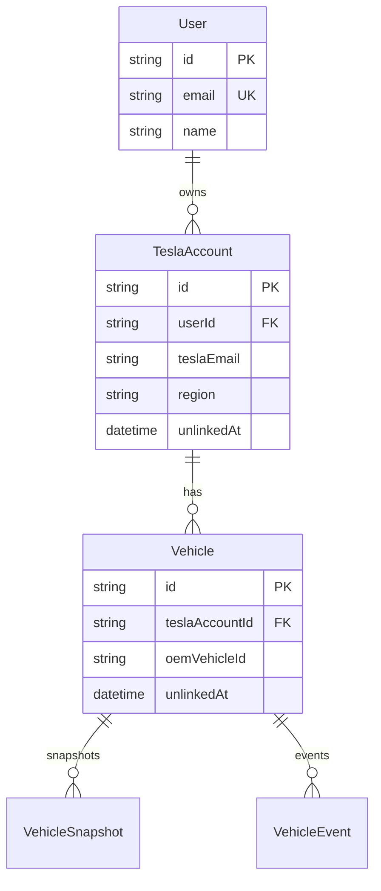

# User·Tesla 계정·차량 DB 요구사항 정의서

## 1. 문서 개요

| 항목 | 내용 |
|------|------|
| 목적 | FMS 고객(사용자) · 테슬라 계정 · 차량 간 **계층형 1:N 관계** DB 설계 요구사항 정의 |
| 관련 문서 | [requirements.md](./requirements.md), [requirements-db.md](./requirements-db.md), [requirements-tech-stack.md](./requirements-tech-stack.md), [requirements-tesla-api.md](./requirements-tesla-api.md), [development-checklist.md](./development-checklist.md) |
| 적용 범위 | **Phase 3.9** (스키마·비즈니스 규칙) → Phase 4(인증) · 이후 멀티 계정·연동 해제 UI |
| 구현 상태 | **Phase 3.9 구현 완료** — Prisma·API·unlink·**세션 User 귀속 TeslaAccount** (2026-07-08). Telemetry API는 stub. Phase 4 Auth 다테넌시 대기 |

---

## 2. 배경·비즈니스 요구사항

### 2.1 제품 구조

본 FMS는 **고객 ID 하나에 다수의 테슬라 차량**이 등록될 수 있는 차량 관제 시스템이다.

| 계층 | 관계 | 설명 |
|------|------|------|
| **User** (FMS 고객) | 1 : N | 한 고객이 **여러 테슬라 계정(이메일)** 을 연동할 수 있음 |
| **TeslaAccount** | 1 : N | 각 테슬라 계정에 **1대 이상** 차량이 존재할 수 있음 |
| **Vehicle** | — | FMS에서 관제 대상이 되는 개별 차량 |

```
User (FMS 고객)
 └── TeslaAccount (테슬라 OAuth 계정, 이메일 단위)
      └── Vehicle (VIN·식별명·스냅샷 등)
```

### 2.2 핵심 비즈니스 규칙

1. **멀티 계정**: 한 FMS 사용자가 개인·법인 등 **복수의 테슬라 계정**을 연결할 수 있어야 한다.
2. **멀티 차량**: 각 테슬라 계정은 `GET /api/1/vehicles` 응답처럼 **다수 차량**을 가질 수 있다.
3. **연동 해제(차량 삭제)**: FMS에서 차량을 “삭제”한다는 것은 **관제 대상에서 제외(Unlink)** 하는 것이며, 물리 삭제(Hard Delete)가 아니다.
4. **요금·정합성**: Fleet Telemetry 등 **과금 API 구독을 반드시 해제**해야 한다. 화면에서만 숨기는 것으로는 부족하다.
5. **데이터 보존**: 운행·이벤트 이력은 감사·분석 목적으로 **소프트 삭제(Soft Delete)** 로 보존하는 것을 권장한다.

---

## 3. Tesla Fleet API 제약 (설계 전제)

[requirements-tesla-api.md](./requirements-tesla-api.md) 및 Tesla 공식 문서를 기준으로, DB 설계 시 반드시 반영할 API 특성은 다음과 같다.

### 3.1 토큰은 **계정 단위**

| 항목 | 내용 |
|------|------|
| 토큰 범위 | Access/Refresh 토큰은 **차량 단위가 아니라 테슬라 계정(OAuth 주체) 단위** |
| 차량 목록 | `GET /api/1/vehicles` 호출 시 해당 계정에 묶인 차량 리스트(1대든 N대든)가 **배열로 한 번에** 반환 |
| 설계 함의 | `TeslaOAuthToken`(또는 후속 `TeslaAccount`)은 **Vehicle과 1:1이 아니라 1:N** 관계여야 함 |

### 3.2 Owner vs Driver 권한

| 역할 | 설명 | 설계 함의 |
|------|------|-----------|
| **Owner** (소유자) | 차량 데이터·원격 제어 등 Fleet API 주요 스코프 | FMS 연동·Telemetry 구독의 **정식 주체** |
| **Driver** (공유 드라이버) | 제한된 권한 — 일부 데이터·명령 불가 | 계정·차량 메타에 **역할(role)** 저장, UI·동기화 시 권한 분기 필요 |

> MVP(데모)에서는 Owner 계정만 지원해도 되나, 스키마에는 `role` 또는 동등 필드를 **nullable로 예약**하는 것을 권장한다.

### 3.3 Telemetry·과금

- Fleet Telemetry 스트리밍은 **구독 단위 과금**이 발생할 수 있다.
- 차량 연동 해제 시 **Telemetry 구독 해제 API** 호출이 선행되어야 한다.
- DB 플래그만으로 “삭제” 처리하면 **요금 폭탄** 및 데이터 정합성 문제가 발생한다.

---

## 4. 엔티티 설계 요구사항

### 4.1 User (FMS 고객)

| 필드(안) | 타입 | 필수 | 설명 |
|----------|------|:---:|------|
| `id` | String (cuid/uuid) | ✅ | FMS 내부 사용자 PK |
| `email` | String | ✅ | 로그인·식별용 (Supabase Auth `auth.users.id`와 연결 예정) |
| `name` | String? | | 표시명 |
| `createdAt` / `updatedAt` | DateTime | ✅ | 감사 |

**요구사항**

| ID | 요구사항 | 우선순위 |
|----|----------|:---:|
| UDB-USER-01 | `User` 1명이 **N개의 `TeslaAccount`** 를 소유 | **P0** |
| UDB-USER-02 | Phase 4 Supabase Auth 도입 시 `User.id` ↔ `auth.users.id` 1:1 매핑 | P0 |
| UDB-USER-03 | 데모(MVP) 단일 관리자도 동일 모델 사용 — `accountKey=default` 단일 토큰은 **과도기**로만 허용 | P1 |

### 4.2 TeslaAccount (테슬라 OAuth 계정)

현행 `TeslaOAuthToken` 단일 행(`accountKey=default`)을 **계정 엔티티로 승격**하는 것을 목표로 한다.

| 필드(안) | 타입 | 필수 | 설명 |
|----------|------|:---:|------|
| `id` | String | ✅ | PK |
| `userId` | String (FK → User) | ✅ | 소속 FMS 고객 |
| `teslaEmail` | String? | | 테슬라 계정 식별(가능 시 OAuth 프로필에서 수집) |
| `region` | String | ✅ | Fleet API 리전 (`na` / `eu` / `cn`) |
| `accessToken` | String | ✅ | 암호화 저장 권장 |
| `refreshToken` | String | ✅ | 암호화 저장 권장 |
| `expiresAt` | DateTime | ✅ | Access 토큰 만료 |
| `scope` | String? | | 부여된 OAuth 스코프 |
| `role` | Enum? | | `OWNER` / `DRIVER` (MVP는 Owner만, 필드 예약) |
| `linkedAt` | DateTime | ✅ | 최초 연동 시각 |
| `unlinkedAt` | DateTime? | | 계정 전체 연동 해제 시각 |
| `createdAt` / `updatedAt` | DateTime | ✅ | 감사 |

**요구사항**

| ID | 요구사항 | 우선순위 |
|----|----------|:---:|
| UDB-TA-01 | OAuth 토큰은 **`TeslaAccount`에만** 저장 — Vehicle에 토큰 필드 금지 | **P0** |
| UDB-TA-02 | `(userId, teslaEmail)` 또는 `(userId, teslaSubjectId)` **유니크** — 동일 계정 중복 연동 방지 | P0 |
| UDB-TA-03 | Refresh token rotation 시 **동일 TeslaAccount 행** 갱신 | P0 |
| UDB-TA-04 | 계정 단위 연동 해제 시 소속 Vehicle 전부 unlink 처리 + Telemetry 일괄 해제 | P1 |

### 4.3 Vehicle (차량) — 기존 모델 확장

현행 `Vehicle`은 User·TeslaAccount와 **FK 없이** 전역 테이블로 존재한다. 아래 확장이 필요하다.

| 필드(안) | 타입 | 필수 | 설명 |
|----------|------|:---:|------|
| `teslaAccountId` | String (FK → TeslaAccount) | ✅* | 소속 테슬라 계정 (*Mock 차량은 nullable 허용) |
| `oemVehicleId` | String? | | Tesla VIN 등 OEM 식별자 (기존 유지) |
| `unlinkedAt` | DateTime? | | FMS 연동 해제 시각 — **소프트 삭제 핵심** |
| `isDeleted` | Boolean | | `unlinkedAt IS NOT NULL`과 동기화 가능 — 쿼리 편의용 |
| (기존) `plateNumber`, `model`, `year` | — | ✅ | 식별·표시 |

**요구사항**

| ID | 요구사항 | 우선순위 |
|----|----------|:---:|
| UDB-VEH-01 | `Vehicle`은 반드시 **하나의 `TeslaAccount`** 에 귀속 (Mock 제외) | **P0** |
| UDB-VEH-02 | 대시보드·목록·지도 API는 **`unlinkedAt IS NULL`** 인 차량만 기본 조회 | **P0** |
| UDB-VEH-03 | `vehicle_snapshots`·`vehicle_events`는 Vehicle 삭제 시 **Cascade 금지** — 이력 보존 | P0 |
| UDB-VEH-04 | `(teslaAccountId, oemVehicleId)` 유니크 — 동일 VIN 중복 등록 방지 | P0 |

### 4.4 ER 다이어그램 (목표)



---

## 5. 연동 해제(Unlink)·소프트 삭제 요구사항

### 5.1 원칙

| 원칙 | 설명 |
|------|------|
| **Soft Delete** | `unlinkedAt` 또는 `isDeleted=true` — DB 행·이력 **유지** |
| **UI 비표시** | 관제 화면·API 기본 조회에서 제외 |
| **Telemetry 선해제** | Tesla Fleet Telemetry **구독 해제 API**를 먼저 호출 — 과금 차단 |
| **Hard Delete 금지** | 운영·감사·재연동 시나리오를 위해 MVP에서 물리 삭제 비권장 |

### 5.2 시나리오별 처리

#### 시나리오 A — 테슬라 계정에 차량이 **다수**인 경우 (일부만 연동 해제)

| 단계 | 동작 |
|------|------|
| 1 | 대상 Vehicle의 Telemetry 구독 해제 |
| 2 | `Vehicle.unlinkedAt = now()` (및 `isDeleted = true`) |
| 3 | `TeslaAccount`·토큰은 **유지** — 나머지 차량 동기화 계속 |
| 4 | UI·API 목록에서 해당 차량만 제외 |

#### 시나리오 B — 테슬라 계정에 차량이 **1대뿐**인 경우 (마지막 차량 연동 해제)

| 단계 | 동작 |
|------|------|
| 1 | 시나리오 A와 동일하게 Vehicle unlink |
| 2 | 해당 계정에 **남은 활성 Vehicle 없음** 확인 |
| 3 | Telemetry·기타 구독 전부 해제 |
| 4 | `TeslaAccount.unlinkedAt = now()` (토큰 폐기 또는 보관 정책에 따라 `refreshToken` 무효화) |
| 5 | 이후 동일 테슬라 계정 재연동 시 **새 OAuth + 신규 TeslaAccount 행** 또는 기존 행 재활성화 정책 결정 필요 |

### 5.3 요구사항 ID

| ID | 요구사항 | 우선순위 |
|----|----------|:---:|
| UDB-UNLINK-01 | 차량 연동 해제 API/UI — 시나리오 A·B 분기 | **P0** |
| UDB-UNLINK-02 | unlink 전 **Telemetry 구독 해제** 필수 (실패 시 재시도·롤백 정책) | **P0** |
| UDB-UNLINK-03 | unlink된 차량의 스냅샷·이벤트는 DB에 보존, 조회 API 기본 제외 | P0 |
| UDB-UNLINK-04 | 마지막 차량 unlink 시 TeslaAccount 토큰 정리·계정 unlink | P1 |
| UDB-UNLINK-05 | unlink 이력·사유(optional) 감사 로그 | P2 |

---

## 6. 현재 구현과의 Gap (2026-07-08)

| 영역 | 현재 (`prisma/schema.prisma`) | 목표 |
|------|-------------------------------|------|
| User | `User` + `teslaAccounts` 1:N | ✅ |
| OAuth 토큰 | `TeslaAccount` (User별·계정별) | ✅ |
| Vehicle | `teslaAccountId` FK + `unlinkedAt`/`isDeleted` | ✅ |
| 연동 해제 | `DELETE /api/vehicles/[id]/unlink` + Telemetry stub | ✅ (Telemetry API 후속) |
| API 조회 | `activeVehicleWhere` 필터 | ✅ |
| Mock | `teslaAccountId` nullable | ✅ |

> **마이그레이션 전략**(구현 Phase): 기존 `TeslaOAuthToken` → 첫 `User` + `TeslaAccount`로 이전, 기존 `Vehicle`에 default `TeslaAccount` FK 부여. 상세는 구현 시 `development-checklist.md` Phase 3.9 참고.

---

## 7. 비기능 요구사항

| 항목 | 요구 |
|------|------|
| 보안 | Access/Refresh 토큰은 애플리케이션 레벨 암호화 또는 Supabase Vault 검토 |
| 인덱스 | `Vehicle(teslaAccountId)`, `Vehicle(unlinkedAt)`, `TeslaAccount(userId)` |
| 다테넌시 | Tesla OAuth·토큰·동기화는 **세션 User**에 귀속. 목록/상세 등 나머지 API 쿼리 스코프는 Phase 4에서 강화 |
| Tesla 귀속 | `/api/auth/tesla` → `tesla_oauth_user` 쿠키 → callback에서 `userId`로 `TeslaAccount` upsert. `admin@fleet.local` 기본 사용자 경로 없음 |
| 인증 UX | 로그인 성공 시 세션 쿠키 발급, `/signin` 외 주요 화면은 인증 필요. 로그인 화면은 최소 문구만 유지하고 `회원가입` 링크는 `/signup` 템플릿으로 연결 |
| 초기 상태 | 최초 로그인 후 등록 차량 0대면 KPI·목록은 `0`/empty, 지도는 렌더링하되 마커 없음 |
| 차량 등록 UX | `/vehicles`의 `차량 추가`는 **Tesla Fleet 연동 안내 모달**을 먼저 표시하고, 확인 후 `/api/auth/tesla`로 이동 |
| Mock 정책 | **Phase 3.9부터 실제 User flow 우선** — Tesla 미연결 시 mock 폴백 없이 빈 데이터 유지 |
| 비용 | Telemetry 구독 수 = 활성(unlinked 아닌) Vehicle 수 상한 관리 |

---

## 8. Phase 배치·선행 조건

```
Phase 3.8  TailAdmin UI + FMS 연동 ✅
     ↓
Phase 3.9  User·TeslaAccount·Vehicle 스키마·API ✅ (본 문서)
     ↓
Phase 4    Supabase Auth — User.id 연동·API 다테넌시
     ↓
Phase 4+   연동 해제 UI·Telemetry API·멀티 계정 설정 화면
```

| 선행 | 후행 |
|------|------|
| Phase 3.6 PostgreSQL ✅ | Phase 3.9 스키마 구현 ✅ |
| Phase 3 OAuth 파이프라인 ✅ | TeslaAccount 승격 ✅ |
| 본 요구사항 문서 ✅ | Phase 4 Auth·다테넌시 |

---

## 9. 완료 기준 (요구사항 단계)

- [x] User · TeslaAccount · Vehicle 계층 및 1:N 관계 정의
- [x] Tesla API 계정 단위 토큰·Owner/Driver 제약 반영
- [x] 연동 해제 시나리오(A/B)·Soft Delete·Telemetry 선해제 원칙 정의
- [x] 현행 스키마 Gap 및 Phase 3.9 배치 명시
- [x] Prisma 스키마·마이그레이션·API 필터·unlink 구현 (2026-07-08)

---

## 10. 참고 자료

| 자료 | 설명 |
|------|------|
| [Tesla Fleet API — Vehicles](https://developer.tesla.com/docs/fleet-api/endpoints/vehicle-endpoints) | `GET /api/1/vehicles` |
| [Tesla Fleet API — Fleet Telemetry](https://developer.tesla.com/docs/fleet-api/fleet-telemetry) | 구독·과금 |
| [requirements-tesla-api.md](./requirements-tesla-api.md) | OAuth·Register·스코프 |
| `prisma/schema.prisma` | 현행 스키마 |

---

## 11. 문서 이력

| 일자 | 내용 |
|------|------|
| 2026-07-08 | 초안 메모 — 멀티 계정·차량, Soft Delete, Telemetry 요금 관점 |
| 2026-07-08 | 요구사항 정의서 정식화 — 엔티티·연동 해제 시나리오·Gap·Phase 3.9 배치 |
| 2026-07-08 | Phase 3.9 구현 — `TeslaAccount`·마이그레이션·unlink API·active 필터 |
| 2026-07-08 | Phase 3.9 로그인 플로우 — 세션 쿠키, 로그인/로그아웃, 차량 0대 초기 상태, mock 폴백 제거 |
| 2026-07-08 | 로그인 UI 정리 — 테스트 계정 안내 박스 제거, `회원가입` 링크 `/signup` 연결 |
| 2026-07-08 | 차량 목록 UX 정리 — `차량 추가` 버튼, Tesla Fleet 연동 안내 모달 |
| 2026-07-08 | 차량 추가 모달 보강 — 확인 시 Tesla OAuth 시작, 배경 오버레이 투명도 완화 |
| 2026-07-08 | 차량 추가 모달 미세 조정 — 오버레이 투명도 추가 완화 |
| 2026-07-08 | TeslaAccount 세션 귀속 — OAuth·동기화를 로그인 User에 연결, `admin@fleet.local` 자동 생성 제거 |
